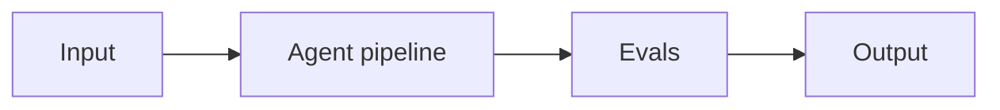

# Project 11: GraphRAG Over a Codebase

> **Difficulty:** ADV · **Skill demonstrated:** GraphRAG, code chunking, repo navigation · **Status:** 🚧 Skeleton

## Problem

Build a code-aware Q&A system that uses GraphRAG to answer questions about a large codebase.

## Architecture



Repo -> tree-sitter chunker -> entity extraction (functions, classes, modules) -> graph -> community summaries -> query.

## Stack

- Python
- graphrag
- tree-sitter
- neo4j
- pytest

## Getting started

```bash
# Install
make install

# Run
make run

# Run tests
make test

# Run evals
make eval
```

## Evals

This project ships with a golden dataset and eval runner. Eval metrics:

- `answer_accuracy`
- `citation_precision`
- `query_latency_p95`

The `make eval` command runs the full eval suite and prints a report. Evals must pass before merging to main.

## Project structure

```
11-graphrag-over-codebase/
├── README.md              # this file
├── pyproject.toml         # dependencies
├── Makefile               # install/run/test/eval targets
├── DEPLOYMENT.md          # how to deploy
├── src/
│   └── __init__.py
├── tests/
│   └── test_smoke.py
├── evals/
│   ├── golden.jsonl       # golden dataset
│   ├── eval_runner.py     # eval runner
│   └── README.md
└── .gitignore
```

## What this project demonstrates

This is a portfolio project. When complete, it should clearly demonstrate:
- GraphRAG, code chunking, repo navigation
- Production concerns: cost, latency, failure modes, security
- Evals: golden dataset + automated runner
- Tests: at least unit + integration
- Deployment: Dockerized, one-command deploy

## Next steps

See `DEPLOYMENT.md` for deployment instructions and `evals/README.md` for the eval methodology.
