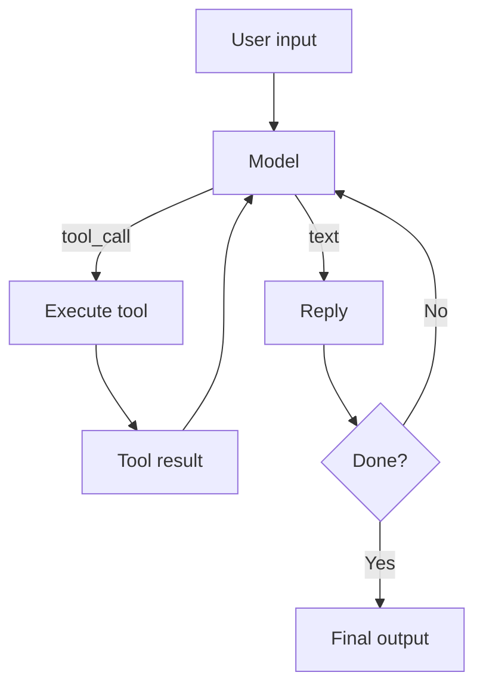

# OpenAI Agents SDK

> **Level:** INT · **Last verified:** 2026-07-30 · **Sources:** [OpenAI Agents SDK](https://github.com/openai/openai-agents-python)

## Why this matters

OpenAI's Agents SDK is the simplest path to a production single-agent system if you're already on OpenAI. It handles the agent loop, tool calls, structured outputs, and handoffs with minimal boilerplate.

## Core concepts

### The four primitives

- **Agent** — instructions + model + tools.
- **Runner** — the loop that calls the model, executes tools, feeds results back.
- **Tool** — a Python function decorated with `@function_tool`, or a `Tool` wrapper.
- **Handoff** — a way for one agent to delegate to another.

### The agent loop



## Code: minimal agent

```python
from agents import Agent, Runner, function_tool

@function_tool
def get_weather(city: str) -> str:
    '''Get weather for a city.'''
    return f"Sunny, 22C in {city}."

agent = Agent(
    name="WeatherAgent",
    instructions="You are a helpful weather assistant. Always use the get_weather tool.",
    tools=[get_weather],
    model="gpt-5",
)

result = Runner.run_sync(agent, "What's the weather in Tokyo?")
print(result.final_output)
```

## Code: agent with handoff

```python
from agents import Agent, Runner, handdoff

billing_agent = Agent(name="Billing", instructions="You handle billing questions.", model="gpt-5")
support_agent = Agent(name="Support", instructions="You handle technical support.", model="gpt-5")

triage = Agent(
    name="Triage",
    instructions="Route the user to billing or support based on their question.",
    handoffs=[billing_agent, support_agent],
    model="gpt-5",
)

result = Runner.run_sync(triage, "I was charged twice last month.")
```

## Production concerns

- **Latency:** Each loop iteration is a full LLM call. Cap iterations.
- **Cost:** Tool definitions count toward input tokens on every iteration.
- **Failure modes:** Agents loop. Always set `max_turns`.
- **Security:** Tool args are model-generated. Validate.

## Anti-patterns

- ❌ **One agent with 30 tools.** Split into multiple agents with handoffs.
- ❌ **No `max_turns`.** Infinite loops in production.
- ❌ **Trusting tool args without validation.**

## References

- [OpenAI Agents SDK](https://github.com/openai/openai-agents-python) — verified 2026-07-30
- [OpenAI Agents docs](https://openai.github.io/openai-agents-python/) — verified 2026-07-30
