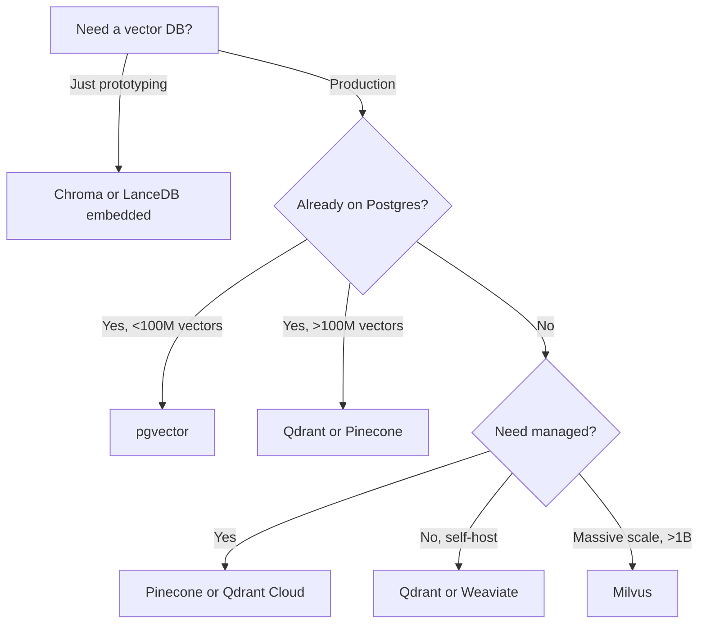

# Choosing a Vector Database

> **Last verified:** 2026-07-30

## The candidates

| Database | Type | Best for | Watch out for |
|----------|------|----------|---------------|
| pgvector | Postgres extension | Already on Postgres, low-to-medium scale | Slower at >100M vectors |
| Pinecone | Managed SaaS | Managed, scale-to-zero, hybrid search | Vendor lock-in, cost at scale |
| Weaviate | Open-source / managed | Hybrid search, modules | More operational complexity |
| Qdrant | Open-source / managed | Rust performance, filtering | Smaller community than Pinecone |
| Milvus | Open-source | Massive scale (billions of vectors) | Operationally heavy |
| Chroma | Embedded | Local dev, prototypes | Not for production scale |
| LanceDB | Embedded, columnar | Local + serverless, multi-modal | Newer ecosystem |

## Decision tree

## Default recommendation

**pgvector** if you're already on Postgres and under ~50M vectors. **Qdrant** otherwise. Switch to **Pinecone** only if you want zero-ops and your CFO approves.

## References

- [pgvector](https://github.com/pgvector/pgvector) — verified 2026-07-30
- [Pinecone](https://www.pinecone.io/) — verified 2026-07-30
- [Qdrant](https://qdrant.tech/) — verified 2026-07-30
- [Vector DB benchmark — ann-benchmarks](https://ann-benchmarks.com/) — verified 2026-07-30
