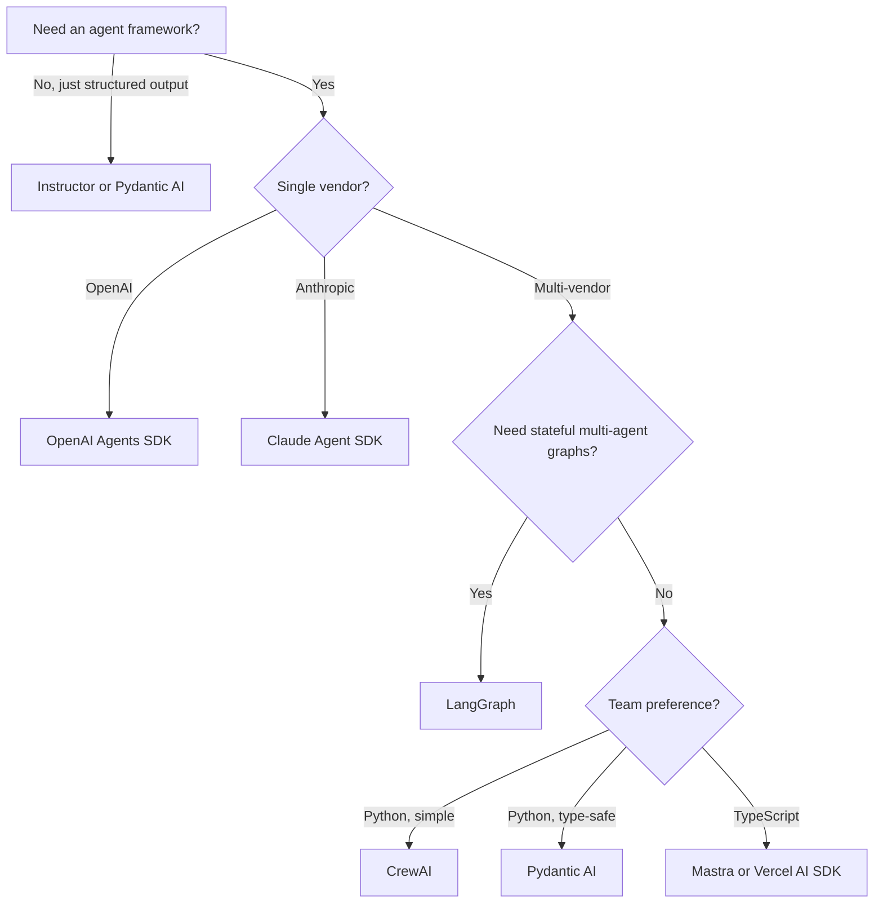

# Choosing an Agent SDK

> **Last verified:** 2026-07-30

## The decision

You're building an agent. Which framework do you reach for?

## The candidates

| SDK | Vendor | Best for | Watch out for |
|-----|--------|----------|---------------|
| OpenAI Agents SDK | OpenAI | OpenAI-only stacks, handoffs, guardrails | Lock-in to OpenAI models |
| Anthropic Claude Agent SDK | Anthropic | Long-horizon agents, computer use, file sandboxing | Anthropic-only |
| LangGraph | LangChain | Stateful multi-agent graphs, complex orchestration | Steeper learning curve |
| CrewAI | CrewAI | Role-based multi-agent, rapid prototyping | Less control over execution |
| AutoGen | Microsoft | Async multi-agent, event-driven | Heavier; .NET heritage shows |
| Google ADK | Google | Vertex-native, Google Workspace integration | Google-cloud-centric |
| Pydantic AI | Pydantic | Type-safe structured outputs, minimal abstraction | Less out-of-the-box agent logic |
| Instructor | jxnl | Pure structured output extraction | Not an agent framework |
| LlamaIndex | LlamaIndex | RAG-first; agents as a secondary concern | Less polished for pure-agent work |
| Mastra | Mastra | TypeScript-native, Vercel-style | TS-only |
| Vercel AI SDK | Vercel | Streaming UIs in Next.js | TS-only, less backend depth |

## The decision tree

## Default recommendation

If you don't know, pick **OpenAI Agents SDK** (Python) for greenfield work in 2026. It's the simplest path to a production agent. Switch to **LangGraph** when you need durable, multi-agent state machines.

## References

- [OpenAI Agents SDK](https://github.com/openai/openai-agents-python) — verified 2026-07-30
- [Anthropic Claude Agent SDK](https://github.com/anthropics/claude-agent-sdk-python) — verified 2026-07-30
- [LangGraph](https://github.com/langchain-ai/langgraph) — verified 2026-07-30
