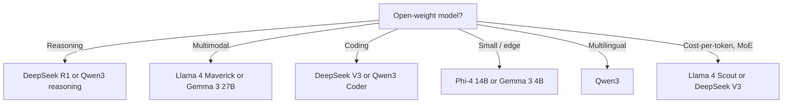

# Open-Weight Model Selection

> **Last verified:** 2026-07-30

## The 2026 lineup

| Family | Sizes | Strengths | License |
|--------|-------|-----------|---------|
| Llama 4 | Scout (17B active), Maverick (17B active), Behemoth (288B) | Multimodal MoE, broad ecosystem | Llama 4 Community License |
| Qwen 3 | 0.6B → 235B | Strong multilingual, reasoning variants | Apache 2.0 (most sizes) |
| DeepSeek V3 / R1 | 671B (37B active) | Reasoning, coding, very cheap to serve | MIT |
| Mistral | 7B, 8x7B, 8x22B, Large 2 | Mature, EU-based | Apache 2.0 (some) |
| Gemma 3 | 1B, 4B, 12B, 27B | Google-backed, multimodal | Gemma license |
| Phi-4 | 14B | Microsoft, reasoning | MIT |

## Decision tree

## Default recommendation

- **General purpose**: Llama 4 Maverick.
- **Reasoning**: DeepSeek R1.
- **Cheap / small**: Gemma 3 12B.
- **Multilingual**: Qwen3.

## References

- [Llama 4 — Meta AI](https://ai.meta.com/blog/llama-4-multimodal-intelligence/) — verified 2026-07-30
- [DeepSeek V3](https://github.com/deepseek-ai/DeepSeek-V3) — verified 2026-07-30
- [Qwen3](https://github.com/QwenLM/Qwen3) — verified 2026-07-30
