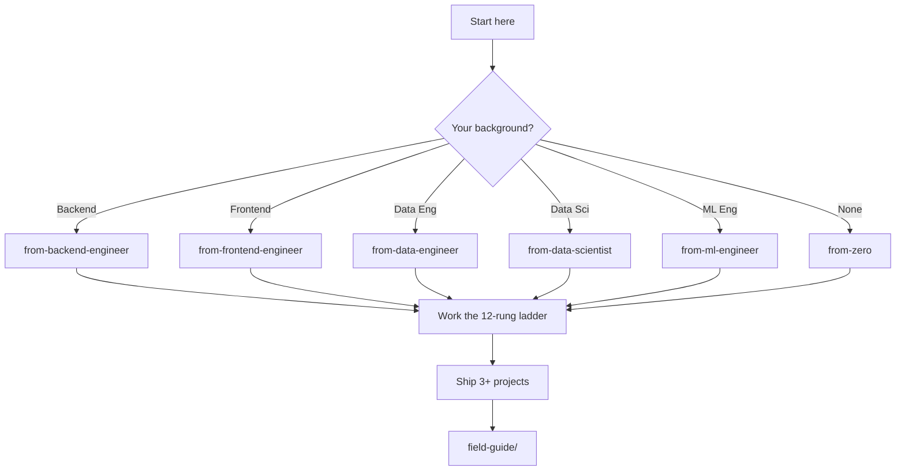

# Learning Paths

This directory contains branching learning paths based on your background. Pick the one that matches your prior experience.

## Visual map

## Time estimates

All estimates assume ~10 hours/week of focused study. Halve them if you can go full-time.

| Path | Time to first project | Time to job-ready portfolio |
|------|----------------------|------------------------------|
| From backend engineer | 4 weeks | 12 weeks |
| From frontend engineer | 6 weeks | 16 weeks |
| From data engineer | 5 weeks | 14 weeks |
| From data scientist | 5 weeks | 14 weeks |
| From ML engineer | 3 weeks | 10 weeks |
| From zero | 8 weeks | 24 weeks |
