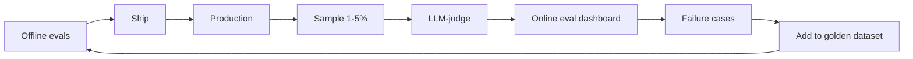

# Online vs Offline Evals

> **Level:** INT · **Last verified:** 2026-07-30

## Why this matters

Offline evals catch regressions before you ship. Online evals catch problems in production you couldn't have predicted. You need both. Skipping either is malpractice.

## Core concepts

### Offline evals

- **When:** Pre-merge, in CI.
- **What:** Golden dataset + LLM-judge + assertions.
- **Cost:** Predictable; runs on every PR.
- **Catches:** Regressions on known cases.

### Online evals

- **When:** Continuous, in production.
- **What:** Sample 1–5% of traffic; judge with LLM-rubric.
- **Cost:** Variable; budgeted.
- **Catches:** Drift, new failure modes, distribution shift.

### The feedback loop



## Code: online eval sampler

```python
import random
from openai import OpenAI

client = OpenAI()

def maybe_eval(query: str, response: str, context: str):
    if random.random() > 0.02:  # 2% sample
        return
    judge_prompt = f'''Score this response 1-5 on groundedness and helpfulness.
    Context: {context}
    Query: {query}
    Response: {response}
    Return JSON: {{"grounded": int, "helpful": int, "reason": str}}
    '''
    score = client.beta.chat.completions.parse(
        model="gpt-5-mini",
        messages=[{"role": "user", "content": judge_prompt}],
        response_format=EvalScore,
    ).choices[0].message.parsed
    # Log to your metrics system
    metrics.gauge("llm.eval.grounded", score.grounded, tags=["model:gpt-5"])
    metrics.gauge("llm.eval.helpful", score.helpful, tags=["model:gpt-5"])
    if score.grounded <= 2 or score.helpful <= 2:
        alert_low_quality(query, response, score)
```

## Production concerns

- **Latency:** Online eval runs after the response; doesn't affect UX.
- **Cost:** 2% sample × 1000 req/day = 20 eval calls/day = ~$0.40/day.
- **Failure modes:** Sample bias (samples only certain query types). Stratify.
- **Security:** Sampled queries may contain PII. Treat as production data.

## Anti-patterns

- ❌ **No online eval.** You're blind in production.
- ❌ **100% online eval.** Cost-prohibitive and noisy.
- ❌ **No path from online failures back to golden dataset.** Failures repeat.

## References

- [Arize Phoenix](https://github.com/Arize-ai/phoenix) — verified 2026-07-30
- [LangSmith: Online evals](https://docs.smith.langchain.com/evaluation) — verified 2026-07-30
- [Hamel Husain: Evals](https://hamel.dev/blog/posts/evals/) — verified 2026-07-30
