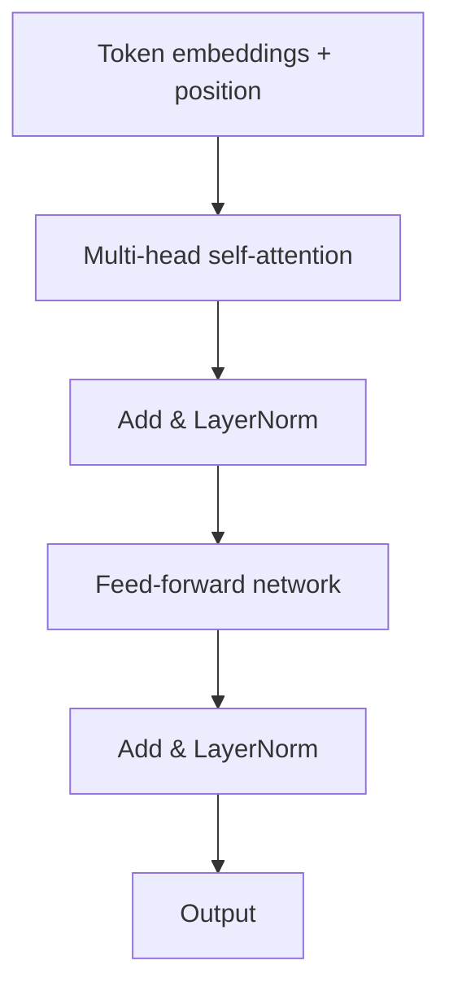

# Transformers Deep Dive

> **Level:** BEG → INT · **Last verified:** 2026-07-30 · **Sources:** [Illustrated Transformer](http://jalammar.github.io/illustrated-transformer/), [Attention Is All You Need](https://arxiv.org/abs/1706.03762)

## Why this matters

Every model you'll touch in 2026 — GPT-5, Claude Opus 4.1, Gemini 3, Llama 4 — is a transformer. You don't need to implement one from scratch, but you need enough mental model to reason about context windows, KV-cache, MoE, and why inference is expensive.

## Core concepts

### The transformer block



Three operations dominate:
1. **Attention** — every token looks at every other token. O(n²) in sequence length.
2. **Feed-forward** — per-token MLP. The "knowledge" lives here.
3. **Residual + LayerNorm** — keeps gradients flowing.

### Attention in one line

```
attention(Q, K, V) = softmax(Q·Kᵀ / sqrt(d_k)) · V
```

### The two-phase inference cost

This is the part most tutorials skip:

| Phase | What happens | Cost |
|-------|--------------|------|
| **Prefill** | Process the prompt; fill KV-cache | Compute-bound; parallel over tokens |
| **Decode** | Generate one token at a time; read KV-cache | Memory-bound; sequential |

Decode is why token generation is slow. The KV-cache is what makes it bearable.

## Code: minimal attention

```python
import torch
import torch.nn.functional as F

def attention(Q, K, V, mask=None):
    # Q, K, V: (batch, heads, seq, d_head)
    d_k = Q.size(-1)
    scores = Q @ K.transpose(-2, -1) / d_k ** 0.5
    if mask is not None:
        scores = scores.masked_fill(mask == 0, float('-inf'))
    weights = F.softmax(scores, dim=-1)
    return weights @ V
```

## Production concerns

- **Latency:** Prefill is parallel; decode is sequential. A 1M-token prompt takes seconds to prefill even on H100s.
- **Cost:** APIs bill separately for input (prefill) and output (decode) tokens. Output is usually 3–5× more expensive per token.
- **Failure modes:** "Lost in the middle" — models attend less well to tokens in the middle of long contexts.
- **Security:** Prompt injection works because attention has no concept of "trusted" vs "untrusted" tokens.

## Anti-patterns

- ❌ **Treating context window as free.** Doubling context does not double latency; it can 4× it (attention is O(n²)).
- ❌ **Assuming bigger context = better recall.** Empirically false past ~64K without retrieval.
- ❌ **Ignoring KV-cache economics.** A 128K context can blow your GPU memory budget on the cache alone.

## Decision framework

If you're picking a model for a task:
- Long input + short output → favor cheap-input models (Gemini Flash, DeepSeek V3).
- Short input + long output → favor cheap-output models (Claude Haiku, GPT-5 mini).
- Both long → use prompt caching aggressively.

## References

- [The Illustrated Transformer — Jay Alammar](http://jalammar.github.io/illustrated-transformer/) — verified 2026-07-30
- [Attention Is All You Need](https://arxiv.org/abs/1706.03762) — verified 2026-07-30
- [The Illustrated Transformer, KV-cache edition — Jay Alammar](https://jalammar.github.io/illustrated-gpt-2/) — verified 2026-07-30
