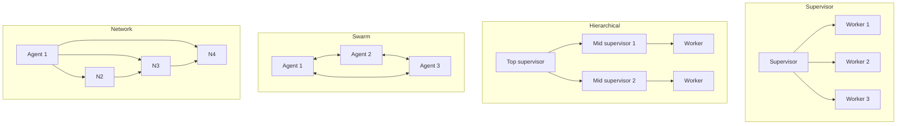
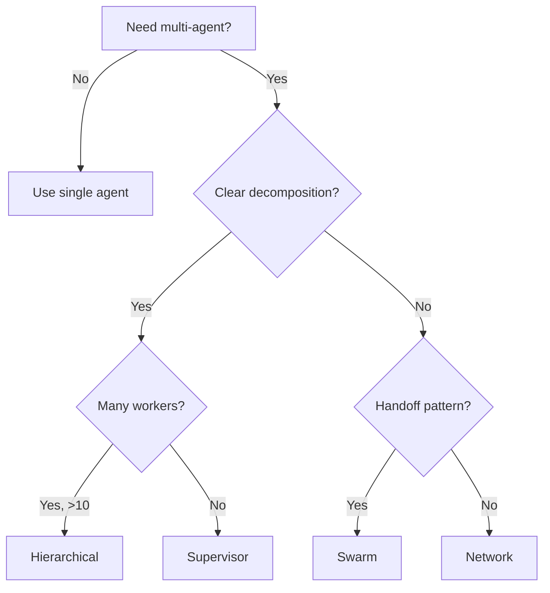

# Multi-Agent Orchestration Topologies

> **Level:** ADV · **Last verified:** 2026-07-30

## Why this matters

The architecture of your multi-agent system is the highest-leverage design decision. Pick the wrong topology and you get agents stepping on each other, infinite handoffs, and untraceable failures. Pick the right one and the system feels designed.

## Core concepts

### Four topologies

| Topology | When to use | Trade-off |
|----------|-------------|-----------|
| **Supervisor** | Clear task decomposition; one brain | Supervisor is bottleneck |
| **Hierarchical** | Large org-like workflows | Complexity; debugging hard |
| **Swarm** | Agents hand off control | Can drift; needs handoff protocols |
| **Network** | Each agent can call any other | Most flexible; can deadlock |

## Decision tree

## Production concerns

- **Latency:** Every handoff adds an LLM call. Cap depth.
- **Cost:** Multi-agent = N× single-agent cost.
- **Failure modes:** Deadlocks (A waits on B waits on A). Detect with timeouts.
- **Security:** Each agent has its own tool access. Limit blast radius.

## Anti-patterns

- ❌ **Network topology with no handoff protocol.** Spaghetti.
- ❌ **Supervisor with 20 direct reports.** Split into hierarchy.
- ❌ **No iteration cap.** Infinite loops.

## References

- [LangGraph: Multi-agent topologies](https://langchain-ai.github.io/langgraph/concepts/multi_agent/) — verified 2026-07-30
- [CrewAI: Crew architecture](https://docs.crewai.com/concepts/crews) — verified 2026-07-30
- [Anthropic: Building effective agents](https://www.anthropic.com/research/building-effective-agents) — verified 2026-07-30
