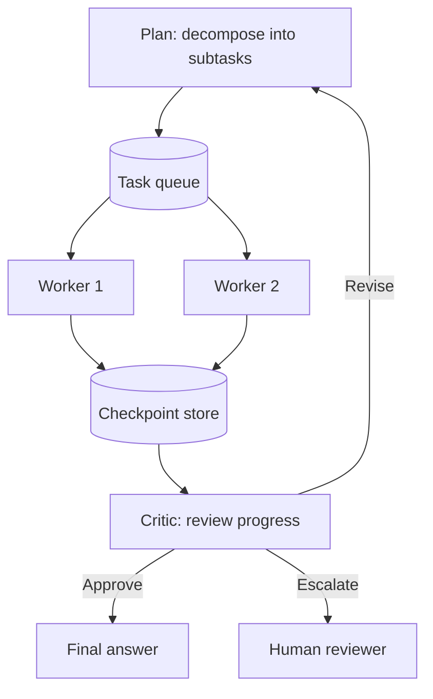

# Long-Horizon Tasks

> **Level:** EXP · **Last verified:** 2026-07-30

## Why this matters

An agent that runs for 5 minutes is hard. An agent that runs for 5 hours is a different beast: state grows, intermediate failures accumulate, costs compound, and you need pause/resume. Long-horizon agents are the frontier of production GenAI in 2026.

## Core concepts

### The four problems

1. **State size** — context grows; you must distill.
2. **Failure recovery** — every step can fail; you must checkpoint.
3. **Cost control** — 5 hours of GPT-5 calls is $100s; you must budget.
4. **Human oversight** — humans can't watch 5 hours; you must summarize.

### The architecture



### Key patterns

- **Plan-then-execute** — decompose upfront, execute subtasks in parallel.
- **Checkpoint every step** — durable storage; resume on crash.
- **Periodic critic review** — every N steps, a critic evaluates progress.
- **Human escalation** — defined trigger conditions for human review.
- **Cost budget** — hard cap on tokens; agent must request more.

## Code: skeleton with checkpoints

```python
from langgraph.graph import StateGraph, START, END
from langgraph.checkpoint.postgres import PostgresSaver

class State(TypedDict):
    plan: list[str]
    completed: list[str]
    artifacts: dict
    cost_spent: float

def planner(state: State) -> State: ...
def worker(state: State) -> State: ...
def critic(state: State) -> str:  # returns next node
    if state["cost_spent"] > 50.0:
        return "human_review"
    if all(s in state["completed"] for s in state["plan"]):
        return "final"
    return "worker"

graph = StateGraph(State)
graph.add_node("planner", planner)
graph.add_node("worker", worker)
graph.add_node("critic", critic)
graph.add_node("human_review", ...)
graph.add_edge(START, "planner")
graph.add_edge("planner", "worker")
graph.add_edge("worker", "critic")
graph.add_conditional_edges("critic", critic, ["worker", "human_review", "final"])

checkpointer = PostgresSaver.from_conn_string("...")
app = graph.compile(checkpointer=checkpointer)
```

## Production concerns

- **Latency:** 5-hour agent = user can't wait. Async + notifications.
- **Cost:** Hard-cap. Alert at 50%, 80%, 100%.
- **Failure modes:** Crashes mid-run. Resume from last checkpoint.
- **Security:** Artifacts may contain sensitive data. Encrypt checkpoints.

## Anti-patterns

- ❌ **No checkpointing.** Crash = full restart.
- ❌ **No cost cap.** One bug = $1000s.
- ❌ **No human escalation.** Agent runs forever on unsolvable sub-task.

## References

- [LangGraph: Long-running agents](https://langchain-ai.github.io/langgraph/concepts/persistence/) — verified 2026-07-30
- [Anthropic: Building effective agents](https://www.anthropic.com/research/building-effective-agents) — verified 2026-07-30
- [DeepAgents](https://github.com/langchain-ai/deepagents) — verified 2026-07-30
