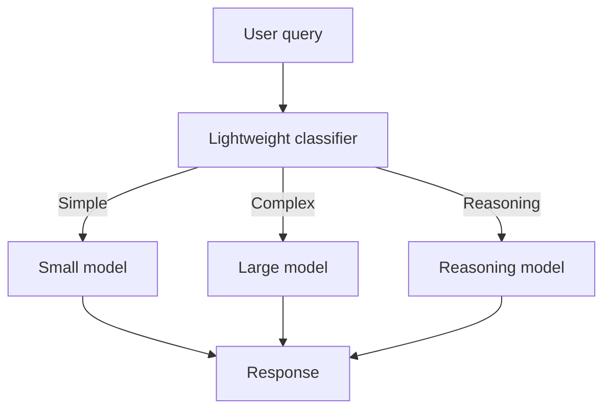

# Cost Engineering

> **Level:** INT · **Last verified:** 2026-07-30

## Why this matters

LLM costs scale linearly with usage and quadratically with prompt length (attention). A naive implementation can cost 10–100× more than an optimized one for the same outcome. Cost engineering is the difference between a sustainable product and a budget crisis.

## Core concepts

### The six levers

| Lever | Savings | Effort |
|-------|---------|--------|
| **Prompt caching** | 50–90% on cached input | Trivial |
| **Model routing** | 50–80% on simple queries | Medium |
| **Prompt compression** | 20–40% on long prompts | Medium |
| **Smaller models for sub-tasks** | 60–90% on sub-tasks | Medium |
| **Batch APIs** | 50% on async workloads | Low |
| **Self-hosting steady state** | 70%+ at high volume | High |

### The routing pattern



A classifier (small fine-tuned model, embedding similarity, or even rules) routes queries by complexity. Simple queries to Haiku/mini/Flash; complex to Sonnet/GPT-5; reasoning-heavy to o3/Claude-with-thinking.

## Code: token budgeting per request

```python
from openai import OpenAI
client = OpenAI()

class BudgetExceeded(Exception): pass

def call_with_budget(messages, model: str, max_input_tokens: int, max_output_tokens: int):
    input_tokens = sum(len(m["content"]) // 4 for m in messages)
    if input_tokens > max_input_tokens:
        raise BudgetExceeded(f"Input {input_tokens} > budget {max_input_tokens}")
    resp = client.chat.completions.create(
        model=model,
        messages=messages,
        max_tokens=max_output_tokens,
    )
    cost = (input_tokens / 1e6) * PRICING[model]["input"] + \
           (resp.usage.completion_tokens / 1e6) * PRICING[model]["output"]
    metrics.gauge("llm.request.cost_usd", cost, tags=[f"model:{model}"])
    return resp, cost
```

## Code: simple classifier routing

```python
from openai import OpenAI
client = OpenAI()

def route(query: str) -> str:
    '''Returns model name based on query complexity.'''
    resp = client.chat.completions.create(
        model="gpt-5-mini",
        messages=[
            {"role": "system", "content": "Classify the query difficulty. Reply with one word: simple, complex, or reasoning."},
            {"role": "user", "content": query},
        ],
        max_tokens=5,
    )
    cls = resp.choices[0].message.content.strip().lower()
    return {"simple": "gpt-5-mini", "complex": "gpt-5", "reasoning": "o3"}.get(cls, "gpt-5")
```

## Production concerns

- **Latency:** Routing adds a small call; worth it.
- **Cost:** Track cost per request, per user, per workflow. Alert on anomalies.
- **Failure modes:** Misrouting to small model degrades quality. Watch evals.
- **Security:** Cost telemetry should not log prompt content.

## Anti-patterns

- ❌ **Using one model for everything.** Always route.
- ❌ **No cost dashboards.** You can't optimize what you don't measure.
- ❌ **Ignoring prompt caching.** The lowest-hanging fruit.

## References

- [OpenAI Batch API](https://platform.openai.com/docs/guides/batch) — verified 2026-07-30
- [Anthropic prompt caching](https://docs.anthropic.com/en/docs/build-with-claude/prompt-caching) — verified 2026-07-30
- [LiteLLM (proxy + routing)](https://github.com/BerriAI/litellm) — verified 2026-07-30
