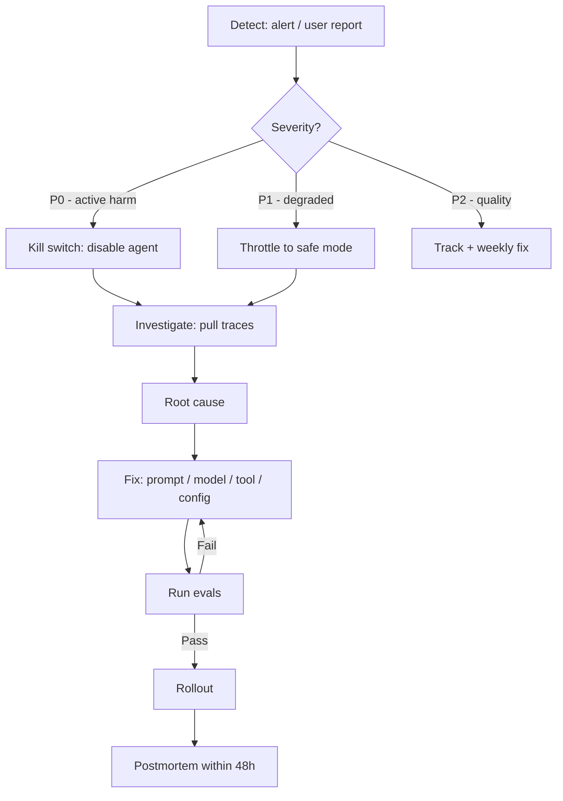

# Incident Response for Agents

> **Level:** ADV · **Last verified:** 2026-07-30

## Why this matters

When your agent misbehaves in production, the playbook is different from a traditional service incident. Agents produce wrong outputs at scale, cost money every minute, and the "fix" might be a prompt change with no rollback path. You need a specific IR flow.

## Core concepts

### The agent IR flow



### The kill switch

Every production agent must have a kill switch that:
- Disables the agent in <1 minute.
- Falls back to a deterministic response or human queue.
- Doesn't require a deploy.

Implementation: feature flag (LaunchDarkly, Statsig, or homegrown).

## Code: the kill switch

```python
import os
from flag_client import is_enabled  # your feature flag system

def agent_endpoint(query: str) -> str:
    if not is_enabled("agent_v2_enabled"):
        return "I'm undergoing maintenance. A human will follow up shortly."
    try:
        return run_agent(query)
    except Exception as e:
        metrics.increment("agent.error")
        return safe_fallback(query, e)
```

## Production concerns

- **Latency:** Kill switch check is <5ms.
- **Cost:** None.
- **Failure modes:** Kill switch itself fails. Make it dead simple.
- **Security:** Access to flip the switch should be tightly controlled.

## Anti-patterns

- ❌ **No kill switch.** One bad prompt ships to all users for hours.
- ❌ **Kill switch requires a deploy.** Too slow.
- ❌ **No postmortem.** Same incident repeats.

## References

- [Google SRE: Incident Response](https://sre.google/sre-book/incident-response/) — verified 2026-07-30
- [Statsig](https://www.statsig.com/) — verified 2026-07-30
- [LaunchDarkly](https://launchdarkly.com/) — verified 2026-07-30
