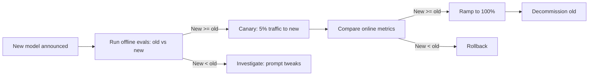

# Model Versioning & Migration

> **Level:** INT · **Last verified:** 2026-07-30

## Why this matters

Frontier model providers deprecate models every 6–12 months. Migrations are inevitable. A bad migration = silent quality regression = incident. A good migration = evals + canary + rollback.

## Core concepts

### The migration flow



### The model config pattern

Never hardcode model names in code. Use a config:

```python
# config/models.yaml
default:
  chat: gpt-5
  reasoning: o3
  small: gpt-5-mini
  embedding: text-embedding-3-large
```

```python
# In code
import yaml
config = yaml.safe_load(open("config/models.yaml"))
model = config["default"]["chat"]
```

To migrate: update the YAML, deploy config-only.

## Code: side-by-side comparison

```python
def compare_models(query: str, old: str, new: str):
    out_old = call_model(old, query)
    out_new = call_model(new, query)
    judge = call_model("gpt-5", f"Which is better for query '{query}'?\nA: {out_old}\nB: {out_new}\nReply 'A' or 'B'.")
    return {"old": out_old, "new": out_new, "judge": judge}
```

## Code: canary with feature flag

```python
def call_chat(query: str) -> str:
    if is_enabled("use_gpt_5_canary", default=False):
        return call_model("gpt-5", query)
    return call_model("gpt-5-previous", query)
```

## Production concerns

- **Latency:** No additional latency.
- **Cost:** Side-by-side evals double cost temporarily.
- **Failure modes:** Models have different tokenizers; token counts shift.
- **Security:** New models may have different data policies (e.g., new vendor). Review DPA.

## Anti-patterns

- ❌ **Hardcoded model names in code.** Makes migration a code change.
- ❌ **Big-bang migration.** Always canary.
- ❌ **No rollback plan.** Always have one.

## References

- [OpenAI: Model deprecations](https://platform.openai.com/docs/deprecations) — verified 2026-07-30
- [Anthropic: Model versions](https://docs.anthropic.com/en/docs/about-claude/models) — verified 2026-07-30
