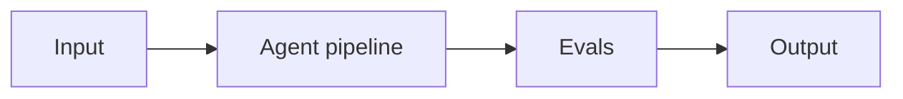

# Project 02: Hybrid RAG Over a Notion Workspace

> **Difficulty:** BEG · **Skill demonstrated:** Chunking, hybrid search, reranking, citations · **Status:** 🚧 Skeleton

## Problem

Build a RAG system over a real Notion workspace with hybrid search (vector + BM25), reranking, and source citations.

## Architecture



Notion API -> chunker -> embedder -> pgvector + BM25 index -> query -> hybrid search -> reranker -> LLM with citations.

## Stack

- Python
- pgvector
- BGE-M3
- BGE Reranker
- FastAPI
- pytest
- ragas

## Getting started

```bash
# Install
make install

# Run
make run

# Run tests
make test

# Run evals
make eval
```

## Evals

This project ships with a golden dataset and eval runner. Eval metrics:

- `faithfulness`
- `answer_relevancy`
- `context_precision`
- `context_recall`

The `make eval` command runs the full eval suite and prints a report. Evals must pass before merging to main.

## Project structure

```
02-hybrid-rag-over-notion/
├── README.md              # this file
├── pyproject.toml         # dependencies
├── Makefile               # install/run/test/eval targets
├── DEPLOYMENT.md          # how to deploy
├── src/
│   └── __init__.py
├── tests/
│   └── test_smoke.py
├── evals/
│   ├── golden.jsonl       # golden dataset
│   ├── eval_runner.py     # eval runner
│   └── README.md
└── .gitignore
```

## What this project demonstrates

This is a portfolio project. When complete, it should clearly demonstrate:
- Chunking, hybrid search, reranking, citations
- Production concerns: cost, latency, failure modes, security
- Evals: golden dataset + automated runner
- Tests: at least unit + integration
- Deployment: Dockerized, one-command deploy

## Next steps

See `DEPLOYMENT.md` for deployment instructions and `evals/README.md` for the eval methodology.
