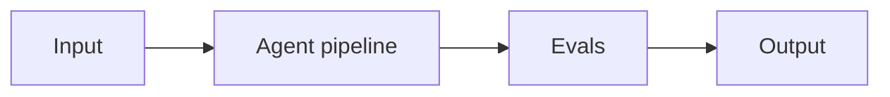

# Project 04: Computer-Use Data Entry Agent

> **Difficulty:** ADV · **Skill demonstrated:** Anthropic computer use, browser automation · **Status:** 🚧 Skeleton

## Problem

Build an agent that takes a spreadsheet of contact data and enters it into a legacy CRM that has no API.

## Architecture



Spreadsheet -> Claude Agent SDK with computer use -> screenshot -> click -> type -> verify -> next row.

## Stack

- Python
- anthropic
- claude-agent-sdk
- playwright
- pytest

## Getting started

```bash
# Install
make install

# Run
make run

# Run tests
make test

# Run evals
make eval
```

## Evals

This project ships with a golden dataset and eval runner. Eval metrics:

- `entry_accuracy`
- `row_completion_rate`
- `avg_steps_per_row`
- `cost_per_row`

The `make eval` command runs the full eval suite and prints a report. Evals must pass before merging to main.

## Project structure

```
04-computer-use-data-entry-agent/
├── README.md              # this file
├── pyproject.toml         # dependencies
├── Makefile               # install/run/test/eval targets
├── DEPLOYMENT.md          # how to deploy
├── src/
│   └── __init__.py
├── tests/
│   └── test_smoke.py
├── evals/
│   ├── golden.jsonl       # golden dataset
│   ├── eval_runner.py     # eval runner
│   └── README.md
└── .gitignore
```

## What this project demonstrates

This is a portfolio project. When complete, it should clearly demonstrate:
- Anthropic computer use, browser automation
- Production concerns: cost, latency, failure modes, security
- Evals: golden dataset + automated runner
- Tests: at least unit + integration
- Deployment: Dockerized, one-command deploy

## Next steps

See `DEPLOYMENT.md` for deployment instructions and `evals/README.md` for the eval methodology.
