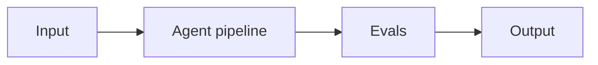

# Project 05: Multi-Agent Research Pipeline

> **Difficulty:** ADV · **Skill demonstrated:** Orchestration, handoffs, sub-agents · **Status:** 🚧 Skeleton

## Problem

Build a multi-agent system that researches a topic, synthesizes findings, fact-checks, and produces a cited report.

## Architecture



Planner -> Researcher -> Writer -> Critic -> loop until quality bar met -> final report.

## Stack

- Python
- langgraph
- openai
- pytest
- promptfoo

## Getting started

```bash
# Install
make install

# Run
make run

# Run tests
make test

# Run evals
make eval
```

## Evals

This project ships with a golden dataset and eval runner. Eval metrics:

- `report_quality_score`
- `citation_accuracy`
- `iteration_count`
- `cost_per_report`

The `make eval` command runs the full eval suite and prints a report. Evals must pass before merging to main.

## Project structure

```
05-multi-agent-research-pipeline/
├── README.md              # this file
├── pyproject.toml         # dependencies
├── Makefile               # install/run/test/eval targets
├── DEPLOYMENT.md          # how to deploy
├── src/
│   └── __init__.py
├── tests/
│   └── test_smoke.py
├── evals/
│   ├── golden.jsonl       # golden dataset
│   ├── eval_runner.py     # eval runner
│   └── README.md
└── .gitignore
```

## What this project demonstrates

This is a portfolio project. When complete, it should clearly demonstrate:
- Orchestration, handoffs, sub-agents
- Production concerns: cost, latency, failure modes, security
- Evals: golden dataset + automated runner
- Tests: at least unit + integration
- Deployment: Dockerized, one-command deploy

## Next steps

See `DEPLOYMENT.md` for deployment instructions and `evals/README.md` for the eval methodology.
