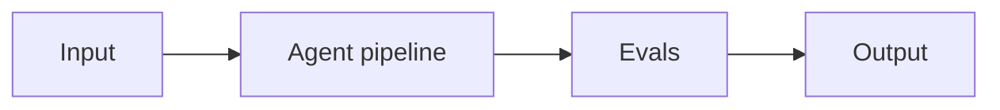

# Project 07: Eval-Driven Prompt Refinement Harness

> **Difficulty:** INT · **Skill demonstrated:** Golden datasets, LLM-as-judge, regression testing · **Status:** 🚧 Skeleton

## Problem

Build a harness that takes a prompt + golden dataset, runs evals, suggests improvements, and gates shipping on regression.

## Architecture



Prompt v1 -> golden dataset -> promptfoo evals -> LLM judge -> diff vs baseline -> ship/block decision.

## Stack

- Python
- promptfoo
- openai
- pytest
- typer

## Getting started

```bash
# Install
make install

# Run
make run

# Run tests
make test

# Run evals
make eval
```

## Evals

This project ships with a golden dataset and eval runner. Eval metrics:

- `eval_pass_rate`
- `regression_count`
- `judge_agreement_rate`

The `make eval` command runs the full eval suite and prints a report. Evals must pass before merging to main.

## Project structure

```
07-eval-driven-prompt-refinement/
├── README.md              # this file
├── pyproject.toml         # dependencies
├── Makefile               # install/run/test/eval targets
├── DEPLOYMENT.md          # how to deploy
├── src/
│   └── __init__.py
├── tests/
│   └── test_smoke.py
├── evals/
│   ├── golden.jsonl       # golden dataset
│   ├── eval_runner.py     # eval runner
│   └── README.md
└── .gitignore
```

## What this project demonstrates

This is a portfolio project. When complete, it should clearly demonstrate:
- Golden datasets, LLM-as-judge, regression testing
- Production concerns: cost, latency, failure modes, security
- Evals: golden dataset + automated runner
- Tests: at least unit + integration
- Deployment: Dockerized, one-command deploy

## Next steps

See `DEPLOYMENT.md` for deployment instructions and `evals/README.md` for the eval methodology.
