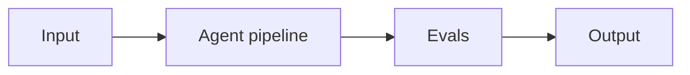

# Project 09: Self-Hosted Llama Deployment

> **Difficulty:** INT · **Skill demonstrated:** vLLM, quantization, breakeven math · **Status:** 🚧 Skeleton

## Problem

Self-host Llama 4 Maverick with vLLM on a single H100, with AWQ quantization, prefix caching, and a cost dashboard.

## Architecture



vLLM server (AWQ, prefix cache) -> OpenAI-compatible API -> Prometheus metrics -> Grafana dashboard.

## Stack

- vLLM
- Docker
- Prometheus
- Grafana
- locust

## Getting started

```bash
# Install
make install

# Run
make run

# Run tests
make test

# Run evals
make eval
```

## Evals

This project ships with a golden dataset and eval runner. Eval metrics:

- `throughput_tokens_per_sec`
- `p95_latency`
- `cost_per_1M_tokens`
- `quality_vs_api`

The `make eval` command runs the full eval suite and prints a report. Evals must pass before merging to main.

## Project structure

```
09-self-hosted-llama-deployment/
├── README.md              # this file
├── pyproject.toml         # dependencies
├── Makefile               # install/run/test/eval targets
├── DEPLOYMENT.md          # how to deploy
├── src/
│   └── __init__.py
├── tests/
│   └── test_smoke.py
├── evals/
│   ├── golden.jsonl       # golden dataset
│   ├── eval_runner.py     # eval runner
│   └── README.md
└── .gitignore
```

## What this project demonstrates

This is a portfolio project. When complete, it should clearly demonstrate:
- vLLM, quantization, breakeven math
- Production concerns: cost, latency, failure modes, security
- Evals: golden dataset + automated runner
- Tests: at least unit + integration
- Deployment: Dockerized, one-command deploy

## Next steps

See `DEPLOYMENT.md` for deployment instructions and `evals/README.md` for the eval methodology.
