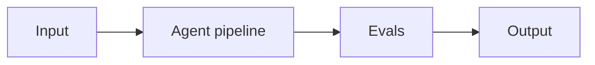

# Project 15: Incident Response Autopilot

> **Difficulty:** ADV · **Skill demonstrated:** Production agents, observability, safety · **Status:** 🚧 Skeleton

## Problem

Build an agent that ingests production alerts, pulls logs/traces, drafts an RCA, and proposes a remediation PR.

## Architecture



Alert webhook -> agent reads logs/traces -> drafts RCA -> opens PR with proposed fix -> human review.

## Stack

- Python
- claude-agent-sdk
- langgraph
- opentelemetry
- github-api

## Getting started

```bash
# Install
make install

# Run
make run

# Run tests
make test

# Run evals
make eval
```

## Evals

This project ships with a golden dataset and eval runner. Eval metrics:

- `rca_quality_score`
- `fix_proposal_accuracy`
- `time_to_draft`
- `human_approval_rate`

The `make eval` command runs the full eval suite and prints a report. Evals must pass before merging to main.

## Project structure

```
15-incident-response-autopilot/
├── README.md              # this file
├── pyproject.toml         # dependencies
├── Makefile               # install/run/test/eval targets
├── DEPLOYMENT.md          # how to deploy
├── src/
│   └── __init__.py
├── tests/
│   └── test_smoke.py
├── evals/
│   ├── golden.jsonl       # golden dataset
│   ├── eval_runner.py     # eval runner
│   └── README.md
└── .gitignore
```

## What this project demonstrates

This is a portfolio project. When complete, it should clearly demonstrate:
- Production agents, observability, safety
- Production concerns: cost, latency, failure modes, security
- Evals: golden dataset + automated runner
- Tests: at least unit + integration
- Deployment: Dockerized, one-command deploy

## Next steps

See `DEPLOYMENT.md` for deployment instructions and `evals/README.md` for the eval methodology.
