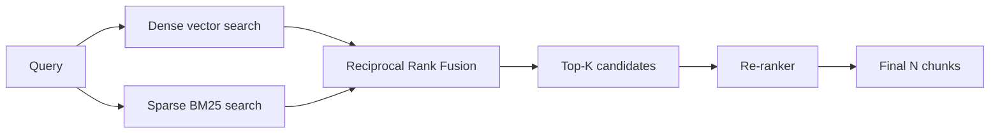

# Hybrid Search

> **Level:** INT · **Last verified:** 2026-07-30

## Why this matters

Pure vector search misses exact-match queries (product codes, error messages, names). Pure keyword search misses semantic matches. Hybrid search blends both and beats either alone by 10–30% on most benchmarks.

## Core concepts

### The two retrievers

- **Dense (vector)** — semantic; "how do I cancel my plan" matches "subscription termination".
- **Sparse (BM25 / SPLADE)** — lexical; "ERR_CONN_REFUSED_4421" matches the exact string.

### The fusion

Two common fusion methods:

1. **Score fusion** — normalize scores from each retriever, weight, sum.
2. **Reciprocal Rank Fusion (RRF)** — `score = sum(1 / (k + rank_i))` for each retriever. Robust to scale differences; `k=60` is the standard.

### Hybrid in one diagram



## Code: hybrid with pgvector + BM25

```python
import psycopg2

def hybrid_search(conn, query_text, query_embedding, k=20):
    with conn.cursor() as cur:
        cur.execute('''
            WITH dense AS (
                SELECT id, content, row_number() OVER (ORDER BY embedding <=> %s) AS rank
                FROM docs
                ORDER BY embedding <=> %s
                LIMIT %s
            ),
            sparse AS (
                SELECT id, content, row_number() OVER (ORDER BY ts_rank(content_tsvector, plainto_tsquery('english', %s)) DESC) AS rank
                FROM docs
                ORDER BY ts_rank(content_tsvector, plainto_tsquery('english', %s)) DESC
                LIMIT %s
            )
            SELECT COALESCE(dense.id, sparse.id) AS id,
                   COALESCE(dense.content, sparse.content) AS content,
                   COALESCE(1.0/(60 + dense.rank), 0) + COALESCE(1.0/(60 + sparse.rank), 0) AS score
            FROM dense FULL OUTER JOIN sparse USING (id)
            ORDER BY score DESC
            LIMIT %s
        ''', (query_embedding, query_embedding, k, query_text, query_text, k, k))
        return cur.fetchall()
```

## Production concerns

- **Latency:** Two retrievals in parallel adds ~1× latency (not 2× if parallelized).
- **Cost:** Self-hosted BM25 is essentially free; dense retrieval is the cost center.
- **Failure modes:** RRF weight tuning is corpus-dependent. Don't copy-paste weights.
- **Security:** BM25 indexes can leak term frequencies; treat as you would any search index.

## Anti-patterns

- ❌ **Dense-only retrieval for code or product catalogs.** Exact match matters.
- ❌ **Sparse-only for chat logs.** Synonyms matter.
- ❌ **Weighted score fusion without normalization.** Comparing apples to oranges.

## References

- [Reciprocal Rank Fusion paper](https://plg.uwaterloo.ca/~gvcormac/cormacksigir09-rrf.pdf) — verified 2026-07-30
- [pgvector hybrid search](https://github.com/pgvector/pgvector#hybrid-search) — verified 2026-07-30
- [Cohere: Hybrid search explainer](https://cohere.com/blog/introducing-hybrid-search) — verified 2026-07-30
