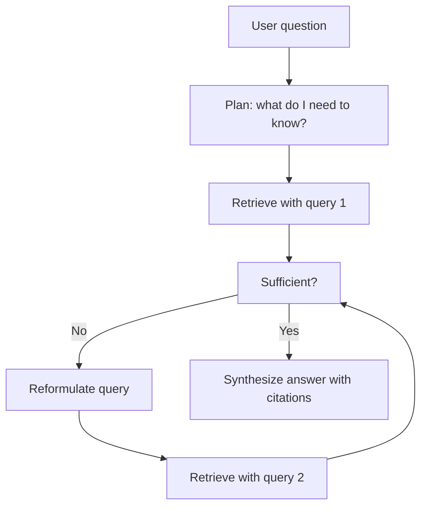

# Agentic RAG

> **Level:** ADV · **Last verified:** 2026-07-30

## Why this matters

Naive RAG retrieves once, then answers. Agentic RAG treats retrieval as a tool: the agent decides when to retrieve, what query to use, whether to retrieve again, and when to stop. On hard multi-hop questions, agentic RAG outperforms naive RAG by 30–100% on recall.

## Core concepts

### The agentic RAG loop



### When agentic RAG wins

- Multi-hop questions ("Compare the revenue growth of Acme and Globex in Q3 2025").
- Questions that need clarification ("Tell me about the API").
- Questions where the first retrieval misses.

### When naive RAG wins

- Single-fact lookup.
- High-throughput, low-latency UX (agentic adds 3–10× latency).
- Cost-sensitive workloads.

## Code: agentic RAG with OpenAI Agents SDK

```python
from agents import Agent, Runner, function_tool

@function_tool
def search_docs(query: str) -> str:
    '''Search the internal documentation.'''
    # hybrid search + rerank, return top-5 chunks concatenated
    return retrieve(query)

agent = Agent(
    name="ResearchAgent",
    instructions='''You answer questions using the search_docs tool.
    - Always search before answering.
    - If the first search doesn't fully answer the question, reformulate and search again.
    - Maximum 3 searches per question.
    - Always cite the source doc name in your answer.''',
    tools=[search_docs],
    model="gpt-5",
)

result = Runner.run_sync(agent, "How does Acme's rate limiter compare to Globex's?")
print(result.final_output)
```

## Production concerns

- **Latency:** Each retrieve + LLM-cycle is 2–5s. Three cycles = 10s+.
- **Cost:** Each cycle is a full LLM call. Cap iterations.
- **Failure modes:** Agents can loop indefinitely on ambiguous queries. Hard-cap iterations.
- **Security:** Each retrieval returns untrusted text. Re-scan for prompt injection on every retrieve.

## Anti-patterns

- ❌ **Defaulting to agentic RAG.** 80% of queries are single-hop; naive RAG is fine.
- ❌ **No iteration cap.** Agents will loop.
- ❌ **No citation enforcement.** Agentic RAG without citations = hallucination factory.

## References

- [Anthropic: Agentic tools](https://docs.anthropic.com/en/docs/build-with-claude/tool-use) — verified 2026-07-30
- [OpenAI Agents SDK](https://github.com/openai/openai-agents-python) — verified 2026-07-30
- [Corrective RAG (CRAG) paper](https://arxiv.org/abs/2401.15884) — verified 2026-07-30
