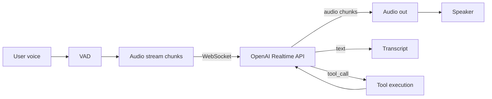

# OpenAI Realtime API

> **Level:** ADV · **Last verified:** 2026-07-30 · **Sources:** [OpenAI Realtime API](https://platform.openai.com/docs/guides/realtime)

## Why this matters

Real-time voice changes the UX of AI. Sub-second conversational agents unlock entirely new product categories: voice customer support, ambient scribes, live coaching. The Realtime API is the cleanest path in 2026.

## Core concepts

### The architecture



### Key concepts

- **Session** — one WebSocket connection = one conversation.
- **Turns** — model listens, responds, listens again.
- **Interruption** — user interrupts model mid-speech; API cancels.
- **Voice activity detection (VAD)** — server-side or client-side.
- **Function calls** — model can call tools mid-conversation.

### Latency budget

| Stage | Target |
|-------|--------|
| User stops speaking → VAD detects | 200ms |
| VAD → first audio token from model | 400ms |
| First audio token → user hears | 100ms |
| **Total response latency** | **~700ms** |

Above 1s feels broken. Below 500ms feels magical.

## Code: minimal Realtime client

```python
import asyncio, json, websockets
import base64

async def realtime_conversation():
    url = "wss://api.openai.com/v1/realtime?model=gpt-realtime"
    headers = {"Authorization": "Bearer YOUR_API_KEY", "OpenAI-Beta": "realtime=v1"}

    async with websockets.connect(url, extra_headers=headers) as ws:
        # Configure session
        await ws.send(json.dumps({
            "type": "session.update",
            "session": {
                "turn_detection": {"type": "server_vad", "threshold": 0.5, "silence_duration_ms": 500},
                "voice": "verse",
                "modalities": ["text", "audio"],
            }
        }))

        # Send audio (from mic)
        async def send_audio():
            async for chunk in mic_audio_stream():
                await ws.send(json.dumps({
                    "type": "input_audio_buffer.append",
                    "audio": base64.b64encode(chunk).decode(),
                }))

        # Receive responses
        async def receive():
            async for msg in ws:
                event = json.loads(msg)
                if event["type"] == "response.audio.delta":
                    speaker.play(base64.b64decode(event["delta"]))
                elif event["type"] == "conversation.item.interruption":
                    speaker.stop()  # user interrupted

        await asyncio.gather(send_audio(), receive())
```

## Production concerns

- **Latency:** WebSocket keepalive; reuse connection.
- **Cost:** Realtime API bills by audio minute. ~$0.06/min.
- **Failure modes:** Network jitter causes audio gaps. Buffer client-side.
- **Security:** Don't log audio; it's PII.

## Anti-patterns

- ❌ **Server-side VAD with silence_duration_ms > 1000.** Feels sluggish.
- ❌ **No interruption handling.** Model keeps talking over user.
- ❌ **Logging raw audio.** Major PII risk.

## References

- [OpenAI Realtime API](https://platform.openai.com/docs/guides/realtime) — verified 2026-07-30
- [OpenAI Realtime API reference](https://platform.openai.com/docs/api-reference/realtime) — verified 2026-07-30
