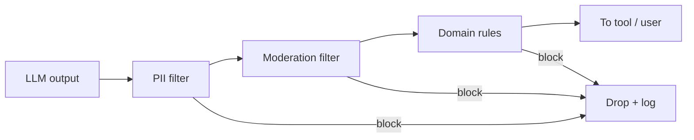

# Output Filtering

> **Level:** INT · **Last verified:** 2026-07-30

## Why this matters

Even with perfect input filtering, models produce harmful outputs: PII leaks, code with security bugs, toxic content, prompt-injection payloads in tool calls. Output filtering is your last line of defense before the user (or the tool) sees the output.

## Core concepts

### Three filter layers

| Layer | What | Example |
|-------|------|---------|
| **PII redaction** | Mask SSNs, emails, phone numbers | `ssn_detector.py` |
| **Content moderation** | Block hate, violence, sexual content | OpenAI moderation API, Azure Content Safety |
| **Domain rules** | Block known-bad patterns for your app | No URLs in response, no SQL keywords |

### The pipeline



## Code: PII redaction

```python
import re

PII_PATTERNS = {
    "ssn": (r"\b\d{3}-\d{2}-\d{4}\b", "[SSN REDACTED]"),
    "email": (r"\b[\w.-]+@[\w.-]+\.\w+\b", "[EMAIL REDACTED]"),
    "phone": (r"\b\+?\d{1,3}?[-.\s]?\(?\d{3}\)?[-.\s]?\d{3}[-.\s]?\d{4}\b", "[PHONE REDACTED]"),
    "credit_card": (r"\b(?:\d[ -]*?){13,16}\b", "[CC REDACTED]"),
}

def redact_pii(text: str) -> tuple[str, list[str]]:
    found = []
    for name, (pat, repl) in PII_PATTERNS.items():
        if re.search(pat, text):
            found.append(name)
            text = re.sub(pat, repl, text)
    return text, found
```

## Code: moderation via OpenAI

```python
from openai import OpenAI
client = OpenAI()

def moderate(text: str) -> tuple[bool, list[str]]:
    resp = client.moderations.create(input=text, model="omni-moderation-latest")
    result = resp.results[0]
    if result.flagged:
        return False, [k for k, v in result.categories.model_dump().items() if v]
    return True, []
```

## Code: domain rules

```python
def domain_filter(text: str, ctx: dict) -> tuple[bool, str | None]:
    # No URLs in customer-facing responses
    if ctx.get("audience") == "customer" and re.search(r"https?://", text):
        return False, "url_in_customer_response"
    # No SQL keywords in tool args
    if ctx.get("target") == "sql_tool":
        if re.search(r"\b(drop|delete|truncate|alter)\b", text, re.IGNORECASE):
            return False, "destructive_sql"
    return True, None
```

## Production concerns

- **Latency:** PII + regex = <5ms. Moderation API = 100–300ms.
- **Cost:** Moderation API is free for OpenAI; self-hosted alternatives exist.
- **Failure modes:** False positives (block legit content) and false negatives (let bad through).
- **Security:** Filter logs may contain blocked content; encrypt.

## Anti-patterns

- ❌ **No output filtering.** Trust the model → leak PII / ship toxic content.
- ❌ **Filtering only some outputs.** All outputs, including tool calls.
- ❌ **Treating moderation API as ground truth.** Audit and tune.

## References

- [OpenAI Moderation API](https://platform.openai.com/docs/guides/moderation) — verified 2026-07-30
- [Azure Content Safety](https://learn.microsoft.com/en-us/azure/ai-services/content-safety/) — verified 2026-07-30
- [Presidio (PII redaction)](https://github.com/microsoft/presidio) — verified 2026-07-30
