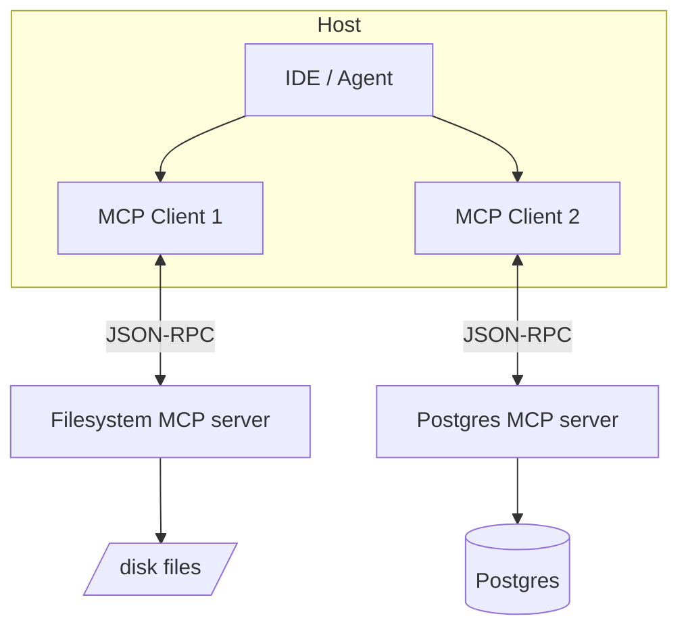

# MCP Architecture

> **Level:** INT · **Last verified:** 2026-07-30 · **Sources:** [Model Context Protocol](https://modelcontextprotocol.io/)

## Why this matters

The Model Context Protocol (MCP), introduced by Anthropic in late 2024, has become the standard way to expose tools, resources, and prompts to LLMs in a vendor-neutral way. In 2026, every major IDE, agent framework, and most enterprise deployments support MCP servers. Understanding MCP is now table stakes.

## Core concepts

### What MCP standardizes

Three primitives:
- **Tools** — functions the model can call (like function calling, but standardized).
- **Resources** — static or dynamic data the model can read (files, DB rows).
- **Prompts** — pre-built prompt templates the server exposes.

### The architecture

A **host** (IDE, agent app) runs multiple **clients**, each connected to one **server**. Servers expose tools/resources/prompts. Clients negotiate capabilities on connect.

### Transports

- **stdio** — local; the host spawns the server as a subprocess.
- **HTTP+SSE** — remote; the server is a long-running service.
- **Streamable HTTP** — newer; better for serverless.

## Production concerns

- **Latency:** stdio is fast (no network). HTTP adds RTT per tool call.
- **Cost:** MCP servers are yours to run. Cheap at scale; not zero.
- **Failure modes:** A misbehaving MCP server can hang the agent. Always have timeouts.
- **Security:** Treat MCP servers like database drivers. Sandbox them. A malicious filesystem MCP server can read SSH keys.

## Anti-patterns

- ❌ **Exposing raw SQL via MCP without read-only enforcement.**
- ❌ **Running untrusted MCP servers in the same process as your agent.**
- ❌ **One giant MCP server with 50 tools.** Split by domain.

## References

- [Model Context Protocol spec](https://modelcontextprotocol.io/) — verified 2026-07-30
- [Anthropic MCP announcement](https://www.anthropic.com/news/model-context-protocol) — verified 2026-07-30
- [Awesome MCP servers](https://github.com/modelcontextprotocol/servers) — verified 2026-07-30
